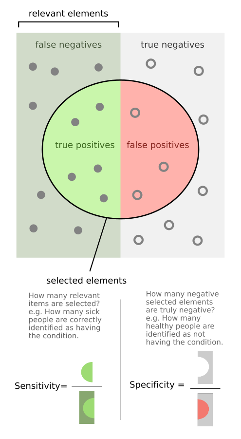
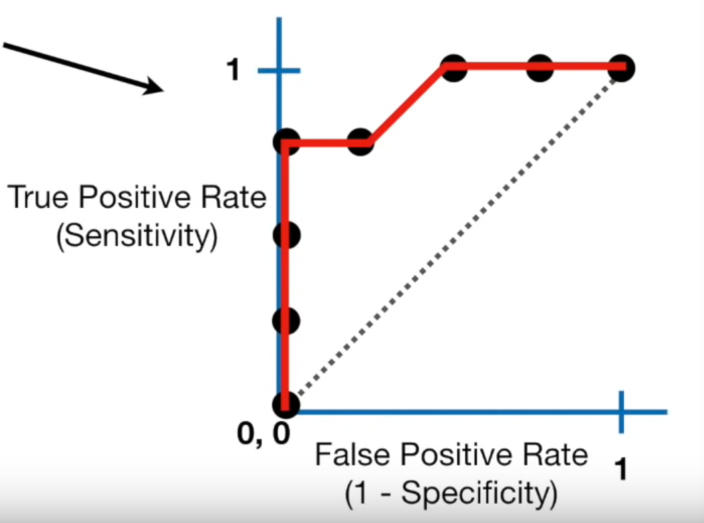
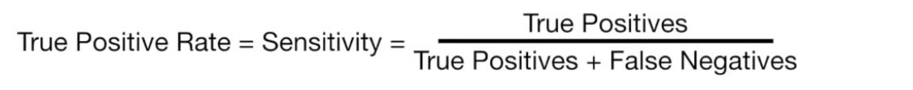
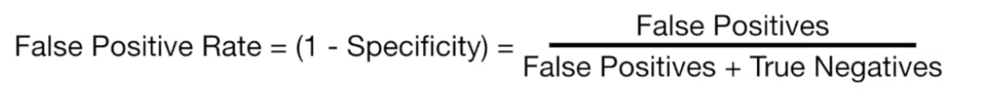
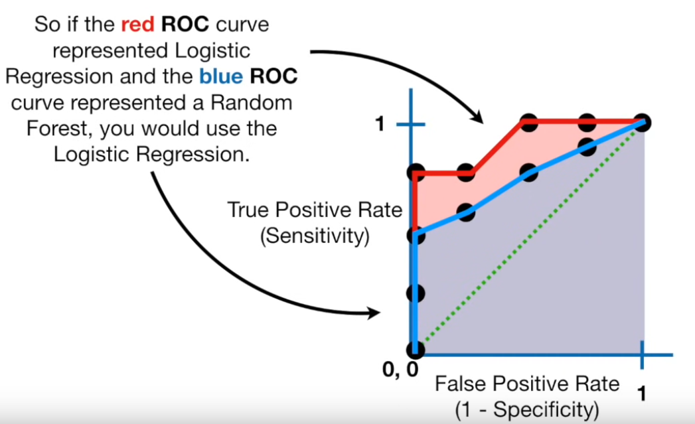

# Artificial Intelligence performance in Image-Based Ovarian Cancer Identification:

### Introduction:
- Accurate identification of `ovarian cancer (OC)` is of paramount importance in *clinical treatment success*. 
- `Artificial intelligence (AI)` is a potentially reliable assistant for the medical imaging recognition.
- This paper is the first systematic review
and `meta-analysis` specifically dedicated to AI systemperformance in the diagnosis of *Overian Cancer*

### Databases searched:
1. [The Medline](https://in.medlineasia.com/)
2. [Embase](https://www.elsevier.com/en-in/products/embase)
3. [IEEE](https://www.ieee.org/)
4. [PubMed](https://pubmed.ncbi.nlm.nih.gov/)
5. [Web of Science](https://mjl.clarivate.com/home)
6. [Cochrane Library](https://www.cochranelibrary.com/)

### Methods used:
-  Acceptable diagnostic performance was demonstrated in
subgroup analyses stratified by imaging modalities `(Ultrasound, Magnetic Resonance Imaging, or Computed Tomogra-
phy)`
- The binary diagnostic accuracy data were extracted to derive the
outcomes of interest: `sensitivity` **(SE)**, `specificity` **(SP)**, and `Area Under the Curve` **(AUC)**. 
- This study also includes meta-analyis
---
### What is Sensitivity and Specificity?

- `sensitivity` and `specificity` describe the accuracy of a test that reports the presence or absence of a medical condition. 
- `Sensitivity`**(true positive rate)** is the probability of a positive test result, conditioned on the individual truly being positive.
- `Specificity` **(true negative rate)** is the probability of a negative test result, conditioned on the individual truly being negative.

[more on sensitivity_and_specificity...](https://en.wikipedia.org/wiki/Sensitivity_and_specificity)

---
### ROG & AUC

A `confusion matrix` represents the prediction summary in matrix form. 

*Example of a Confusion  Matrix*

It consists of ***four basic characteristics*** that are used to define the measurement metrics of any classifier. They are:
1. **TP (True Positive)**: TP represents the number of patients who have been properly classified to the class having the disease and they are also sufferening from the disease.
2. **TN (True Negative)**: TN represents the number of correctly classified patients who are healthy.
3. **FP (False Positive)**: FP represents the number of misclassified patients with the disease but actually they are healthy.
4. **FN (False Negative)**: FN represents the number of patients misclassified as healthy but actually they are suffering from the disease.

In any classifier, a **threshold**  is set,which is then responsible for classifying new examples into their **respective classes**. Thus, it is important to choose the most appropriate threshold.

Different thresholds for a classifier can result in various confusion matrices, which becomes really complex to analyse. Hence, ROG is used.
    
**ROG** stands for `Reciever Operator Graph`. It is used to compare the different confusion matrics produced by taking different thresholds.

Where, **True Positive Rate** is calculated by:

 While, **False Positive Rate** is calculated by:

**AUC** stands for `Area Under Curve`. It is used to compare one ROC curve with another. Hence, it is used to compare the performance of different classificatio algorithms. Greater the AUG, higher will be performance of the model.

Imp:
- really good video:
[ROC and AUC, Clearly Explained!](https://www.youtube.com/watch?v=4jRBRDbJemM)
- more info: [Google Developers](https://developers.google.com/machine-learning/crash-course/classification/roc-and-auc)
- more on confusion matrics: [towards data science](https://towardsdatascience.com/understanding-confusion-matrix-a9ad42dcfd62)