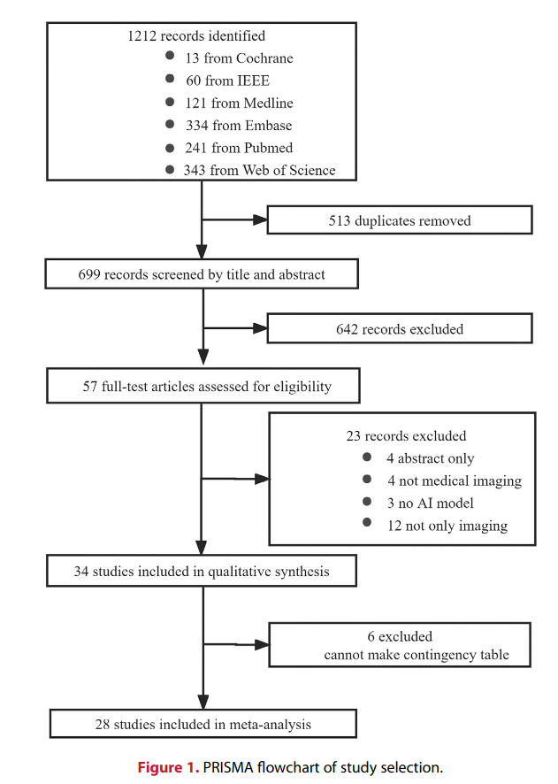
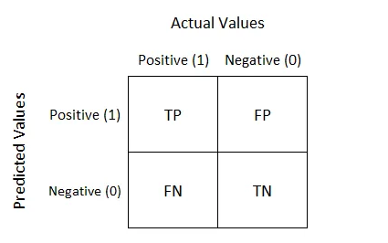

# Artificial Intelligence performance in Image-Based Ovarian Cancer Identification:

### Table of Contents

- [Introduction](#introduction)
- [Databases Searched](#databases-searched)
- [Methods Used](#methods-used)
- [Meta-Analysis Overview](#meta-analysis-overview)
- [What is Sensitivity and Specificity?](#what-is-sensitivity-and-specificity)
- [ROC and AUC](#roc--auc)
- [sROC](#sroc)
- [Problems with Deep Learning-Based Approach](#problems-with-deep-learning-based-approach)
- [Importance of Data in AI Development](#importance-of-data-in-ai-development)
- [Integration with Clinical Workflows](#integration-with-clinical-workflows)
- [Metrics and Reporting](#metrics-and-reporting)
- [Inconsistency of Terminology](#inconsistency-of-terminology)
- [Further Claims](#further-claims)
- [Note](#note)

### Introduction:
- Accurate identification of `ovarian cancer (OC)` is of paramount importance in *clinical treatment success*. 
- `Artificial intelligence (AI)` is a potentially reliable assistant for the medical imaging recognition.
- This paper is the first systematic review
and `meta-analysis` specifically dedicated to AI systemperformance in the diagnosis of *Overian Cancer*

[Original Paper](https://www.thelancet.com/journals/eclinm/article/PIIS2589-5370(22)00392-3/fulltext) | [More on Overian Cancer](https://en.wikipedia.org/wiki/Ovarian_cancer) | [Obstetrics & Gynaecology](https://www.thelancet.com/collections/obstetrics-gynaecology?parent=001603)

### Databases Searched:
1. [The Medline](https://in.medlineasia.com/)
2. [Embase](https://www.elsevier.com/en-in/products/embase)
3. [IEEE](https://www.ieee.org/)
4. [PubMed](https://pubmed.ncbi.nlm.nih.gov/)
5. [Web of Science](https://mjl.clarivate.com/home)
6. [Cochrane Library](https://www.cochranelibrary.com/)

### Methods used:

-  Acceptable diagnostic performance was demonstrated in
subgroup analyses stratified by imaging modalities `(Ultrasound, Magnetic Resonance Imaging, or Computed Tomogra-
phy)`

- The binary diagnostic accuracy data were extracted to derive the
outcomes of interest: `sensitivity` **(SE)**, `specificity` **(SP)**, and `Area Under the Curve` **(AUC)**. 

- This study also incorporates `meta-analyis`, which is the **statistical combination** of results from two or more separate studies.

- Potential advantages of meta-analyses include an improvement in ***precision***, the ability to answer questions not posed by individual studies, and the opportunity to ***settle controversies*** arising from conflicting claims.

## Meta-Analysis Overview:

- **Total Studies Identified:** 34
- **Studies Included in Meta-Analysis:** 28

### Overall Diagnostic Performance

- **Sensitivity (SE):** 88% (95% CI: 85−90%)
- **Specificity (SP):** 85% (95% CI: 82−88%)
- **Area Under Curve (AUC):** 0.93 (95% CI: 0.91−0.95)

### Performance by Algorithm Type

- **Machine Learning:**
  - **Sensitivity (SE):** 89% (95% CI: 85−92%)
  - **Specificity (SP):** 88% (95% CI: 82−92%)

- **Deep Learning:**
  - **Sensitivity (SE):** 88% (95% CI: 84−91%)
  - **Specificity (SP):** 84% (95% CI: 80−87%)

### Subgroup Analysis Results

- **Imaging Modalities:**
  - Ultrasound
  - Magnetic Resonance Imaging (MRI)
  - Computed Tomography (CT)

- **Sample Size:**
  - less than or equal to 300
  - greater than 300

- **AI Algorithms vs. Clinicians:**
  - Comparison of AI performance against clinicians

- **Year of Publication:**
  - Before 2020
  - After 2020

- **Geographical Distribution:**
  - Asia
  - Non-Asia

- **Risk of Bias Levels:**
  - ≥3 domain low risk
  - < 3 domain low risk

---
### What is Sensitivity and Specificity?

- `sensitivity` and `specificity` describe the accuracy of a test that reports the presence or absence of a medical condition. 
- `Sensitivity`**(true positive rate)** is the probability of a positive test result, conditioned on the individual truly being positive.
- `Specificity` **(true negative rate)** is the probability of a negative test result, conditioned on the individual truly being negative.

[more on sensitivity_and_specificity...](https://en.wikipedia.org/wiki/Sensitivity_and_specificity)

---
### ROC & AUC

A `confusion matrix` represents the prediction summary in matrix form. 

*Example of a Confusion  Matrix*

It consists of ***four basic characteristics*** that are used to define the measurement metrics of any classifier. They are:
1. **TP (True Positive)**: TP represents the number of patients who have been properly classified to the class having the disease and they are also sufferening from the disease.
2. **TN (True Negative)**: TN represents the number of correctly classified patients who are healthy.
3. **FP (False Positive)**: FP represents the number of misclassified patients with the disease but actually they are healthy.
4. **FN (False Negative)**: FN represents the number of patients misclassified as healthy but actually they are suffering from the disease.

In any classifier, a **threshold**  is set,which is then responsible for classifying new examples into their **respective classes**. Thus, it is important to choose the most appropriate threshold.

Different thresholds for a classifier can result in various confusion matrices, which becomes really complex to analyse. Hence, ROG is used.
    
**ROG** stands for `Reciever Operator Graph`. It is used to compare the different confusion matrics produced by taking different thresholds.

*Example of a ROG*

Where, **True Positive Rate** is calculated by:

 While, **False Positive Rate** is calculated by:

**AUC** stands for `Area Under Curve`. It is used to compare one ROC curve with another. Hence, it is used to compare the performance of different classificatio algorithms. Greater the AUG, higher will be performance of the model.

*Example of a AUC*

Imp:
- really good video:
[ROC and AUC, Clearly Explained!](https://www.youtube.com/watch?v=4jRBRDbJemM)
- more info: [Google Developers](https://developers.google.com/machine-learning/crash-course/classification/roc-and-auc)
- more on confusion matrics: [towards data science](https://towardsdatascience.com/understanding-confusion-matrix-a9ad42dcfd62)

---
### sROC
* Summary receiver operating characteristics (sROC) analysis is a recently developed statistical technique that can be applied to meta-analysis of diagnostic tests. 
* The sROC curve is initially constructed by plotting the sensitivity (true positivity) and false positivity (1 - specificity) of each study. 
* After mathematical manipulation of the true and false positivities, linear regression is performed to calculate the slope and y-intercept. These coefficients are then entered into the sROC equation to generate the sROC curve. 

sROC curve of all 28 studies,which were included in the meta-analysis(from the paper)

---
### Problems with Deep Learning based approach:

- `DL methods` being more prone to **overfitting** and hence
often requiring more data.
- A `sub-analysis` of different algorithms, was performed, where no significant difference was observed.
- This may be attributed to the `small dataset` of
included studies, most of which collected a few hundred
data, **limiting the advantages of DL**.

---
### Importance of Data in AI Development:

- **Data Quality**: High-quality, well-curated data is crucial for training effective AI models.

- **Interconnected Databases**: Advocacy for global, interconnected patient data networks is needed.

- **Rare Cancers**: More diverse image databases are required for rare cancers.

### Curation Challenges:
-  Maximization of the *power of AI* will require the deposition
of medical data with **sufficient annotation** in large-scale databases.
- However, such data are **rarely
curated**, and this represents a major *bottleneck* in attempting to learn any AI model
- *International collaborative projects* (such as [The Cancer Imaging
Archive](http://www.cancerimagingarchive.net)) that
build **large**, **labeled datasets** should make a substantial
contribution to meeting this challenge

### Integration with Clinical Workflows:
It has been suggested
that scientific research should shift from an *AI-physician dichotomy* (conflict) to a combination of AI and clinicians,
which would be more in line with **realistic medical workflows**.

### Metrics and Reporting:

Common metrics include **sensitivity (SE)**, **specificity (SP)**, and **accuracy**, but other metrics like `precision` and `F1 score` are also used.

The paper further claims:

If the number of subjects with/without disease is shown in the study, they can also combine SE and SP
to derive TP, TN, FP, and FN for the construction of the `contingency table`

Other metrics like `precision`, `dice
ratio`, `F1 score` and `recall`, which are frequently used in
computer science, also present as the default standard
of measurement in some studies.

### Inconsistency of Terminology:
- There is a disagreement around the critical terminology applied in AI research.
- Different papers have defined the same terminology in *different ways*. 

### Further Claims:
> Within a purely **image-based setting**, AI can achieve on par or *superior performance* to *physicians*
>>Thus, highlighting its potential as a **decision support system** with immediate clinical implications.

> The high performance of AI model comes at the cost of **high complexity** and **vast number of parameters**. 
>>Hence, we may be *unable to understand* and *explain* why an AI model has made certain classifications in *image analysis*.
>>>This type of algorithm is often referred to as a **“black box”**

## Note:
- Most studies were carried out in a single center with limited data availability.
- Only three of the
included studies have external validation.
- However, among the three included studies with external valida-
tion, only one was included in the meta-analysis.
- The lack of an external validation set may potentially lead to overestimation of the results, which could compromise the generalizability of the model.

[Original Paper](https://www.thelancet.com/journals/eclinm/article/PIIS2589-5370(22)00392-3/fulltext) | [More on Overian Cancer](https://en.wikipedia.org/wiki/Ovarian_cancer) | [Obstetrics & Gynaecology](https://www.thelancet.com/collections/obstetrics-gynaecology?parent=001603)